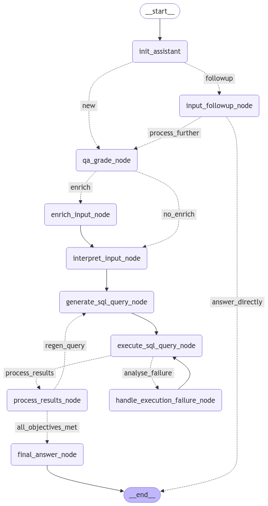

```
      _                   _                       
     | |                 | |                      
   __| | ___   ___  _ __ | |__   ___  ___ _ __   
  / _` |/ _ \ / _ \| '__|| '_ \ / _ \/ _ \ '_ \  
 | (_| | (_) | (_) | |   | |_) |  __/  __/ | | | 
  \__,_|\___/ \___/|_|   |_.__/ \___|\___|_| |_| 
                                                  
```

Doorbeen is an intelligent SQL assistant that connects Large Language Models (LLMs) with databases, allowing users to interact with their data using natural language. Ask questions about your data in plain English, and Doorbeen translates them into SQL queries, executes them, and presents the results in a human-readable format.

## Features
- **Natural Language Interface**: Ask questions about your data in plain English without writing SQL
- **Multi-Database Support**: Connect to PostgreSQL, MySQL, Oracle, SQLite, BigQuery.
- **Intelligent Query Generation**: Translates questions into optimized SQL queries
- **Error Handling**: Automatically detects and fixes SQL errors
- **Result Analysis**: Analyzes query results and presents insights in an understandable format
- **Data Visualization**: Generates visualizations based on query results
- **Streaming Responses**: View results as they are generated
- **Follow-up Questions**: Ask follow-up questions that maintain context from previous queries


## Supported Databases

- PostgreSQL
- MySQL  
- Oracle
- SQLite
- BigQuery

## Before you get started

### Clerk Authentication
Doorbeen uses Clerk for user authentication. You'll need to create a Clerk account and set up an application to obtain your API keys.
For Clerk authentication setup, please refer to the [official documentation](https://clerk.com/docs/quickstarts/setup-clerk).

### FormKit Pro Components
Doorbeen uses FormKit Pro components (Toggle Button and Dropdown) in the frontend playground. A FormKit Pro license is only required for usage in production instances:
1. Purchase a FormKit Pro license from https://formkit.com/
2. Add your license key to the environment variables
For more information on FormKit Pro, visit the [FormKit Pro documentation](https://formkit.com/pro).


### Environment Setup
The repository contains example environment files that you should use as templates:
1. Root directory: Copy `example.env` to `local.env` and update the values:
```bash
cp example.env local.env
```

2. Frontend playground: Copy `frontend/playground/example.env` to `frontend/playground/local.env` and update the values:
```bash
cp frontend/playground/example.env frontend/playground/local.env
```
Be sure to replace placeholder values with your actual credentials:
- Replace `sk_test_password` with your Clerk Backend API Key
- Replace `pk_test_<unique-id>` with your Clerk Publishable Key
- Replace `sk_test_<unique-id>` with your Clerk Secret Key
- Update other environment variables as needed


## Usage Example

```python
from doorbeen import SQLAssistant
from core.models.model import ModelInstance

# Configure database connection
db_credentials = {
    "host": "localhost",
    "port": 5432,
    "username": "user",
    "password": "password",
    "database": "mydb"
}

# Initialize SQL assistant
assistant = SQLAssistant(
    client=CommonSQLClient(credentials=db_credentials),
    db_type="postgresql",
    model=ModelInstance(name="gpt-4", api_key="your-api-key")
)

# Ask a question in natural language
response = assistant.ask_assistant(
    question="What were our top 5 customers by revenue last month?"
)

# Access the results
print(f"SQL Query: {response.query}")
print(f"Results: {response.result}")
```
### Reasoning Flow



## Development

Doorbeen uses a modular architecture that makes it easy to add new capabilities:

- Add new database support by implementing connector classes
- Create new analysis nodes for specialized data processing
- Extend visualization capabilities for different data types
- Add new LLM models for improved performance

### Using direnv for automatic environment loading
The repository provides `.envrc` files in both the root and `frontend/playground` directories. If you use `direnv`, these files will automatically load the environment variables from your `.env` files.
To use `direnv`:
1. Install `direnv` following the official installation instructions
2. Run `direnv allow` in both the root directory and the `frontend/playground` directory
3. `direnv` will automatically load your environment variables when you navigate to these directories

## API Documentation

You can access the complete API documentation by navigating to the `/docs` route after starting the application. This interactive documentation provides details on all available endpoints, request parameters, and response formats.

## Docker Setup

### Building and Running with Docker

#### Docker Compose:
Make sure to add your environment files with the necessary configuration.
Then run:
```bash
docker compose up
```
This command will create and start all the required services.
After starting the container, you can access the application backend at http://localhost:9001, frontend at http://localhost:3000 and the API documentation at http://localhost:9001/api/v1/docs.


## License

Doorbeen is licensed under the MIT License, a short and simple permissive license with conditions only requiring preservation of copyright and license notices. Licensed works, modifications, and larger works may be distributed under different terms and without source code.
